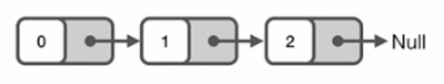
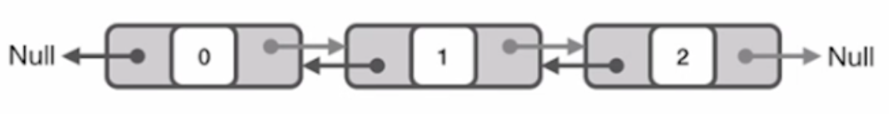

# 第01讲：常用数据结构

##  1.1 常用数据结构和技巧:
- 数组、字符串 Array & String
- 链表 Linked-list
- 栈 Stack
- 队列 Queue
- 双端队列 Deque
- 树 Tree

## 1.2 数组、字符串 / Array & String
### 数组的优缺点：
#### 优点
- 构建一个数组很简单
- 能在O(1)的时间里根据数组的下标(index)查询某个元素

#### 缺点
- 构建时必须分配一段连续的空间
- 查询某个元素是否存在需要遍历整个数组，耗费O(n)的时间
- 删除和添加某个元素时，同样需要耗费O(n)的时间

## 1.3 链表 / linked list
### 单链表
链表中每个元素实际上是一个单独的对象，而所有对象都通过每个元素中的引用字段链接在一起。

### 双链表
与单链表不同的是，双链表的每个节点中都含有**两个引用字段**。

### 链表的优缺点
#### 优点
- 灵活地分配内存空间
- 能在O(1)时间内删除或者添加元素

#### 缺点
- 不像数组能通过下表迅速读取元素，每次需要从链表头开始一个一个读取
- 查询元素需要O(n)时间

### 解题技巧
- 利用快慢指针(有时候需要用到三个指针)
   - 链表翻转
   - 寻找链表中第k个元素
   - 寻找链表中中间位置的元素
   - 判断链表是否有环
- 构建一个虚假的链表头
   - 两个排序链表，进行整合排序
   - 将链表的奇偶数按照原定顺序分离，生成前半部分为奇数，后半部分为偶数的链表

### 如何训练该技巧
在纸上或者白板上画出节点间的相互关系，画出修改的方法

## 1.4 栈 / Stack
### 特点
先进后出(FILO)

### 算法基本思想
可以用一个单链表来实现栈

### 什么情况下需要用到栈呢？
- 只关心上一次的操作
- 处理完上一次操作后，能在O(1)时间内查找到更前一步的操作

## 1.5 队列 / Queue
### 特点
先进先出(FIFO)

### 算法基本思想
有头指针和尾指针的链表就能实现

### 什么情况下需要用到队列呢？
- 当需要按照一定顺序处理数据
- 数据的长度不断变化

## 1.6 双端队列 / Queue
### 基本实现
- 可以利用一个双连标
- 队列的头尾两端能在O(1)的时间内进行数据的查看、添加和删除

### 什么情况下需要用到双端队列呢？
实现一个长度动态变化的窗口或者连续区间

## 1.7 树 / Tree
### 树的共性
- 结构直观
- 常用与递归

### 面试中常考的树的类型
- 普通二叉树
- 平衡二叉树
- 完全二叉树
- 二叉搜索树
- 四叉树
- 多叉树
- **特殊的树：**红黑树、自平衡二叉搜素树

### 树的考题
- 遍历
   - 前序遍历(Preorder Traversal): 在树中进行搜索或者建立一颗新的树
   - 中序遍历(Inorder Traversal): 二叉搜索树
   - 后序遍历(Postorder Traversal): 
