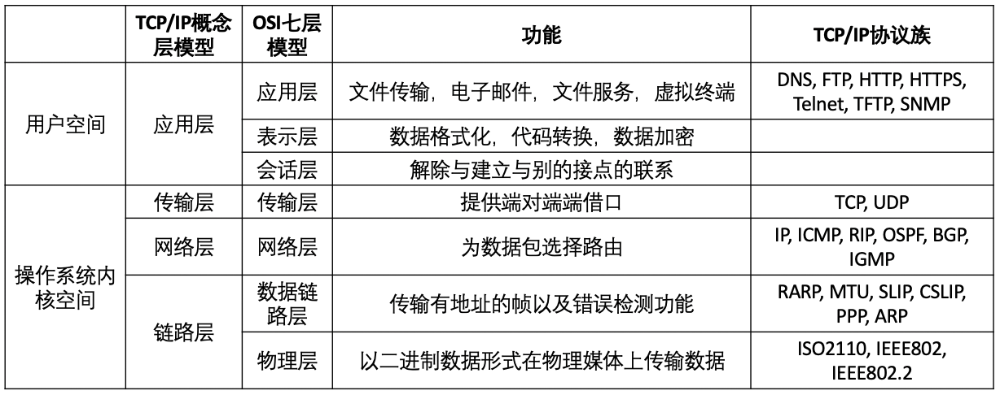

# 计算机网络校招复习
笔记学习自B站UP主 CodeSheep -- [计算机网络该怎么学](https://www.bilibili.com/video/av54705489)

计算机网络主要指的就是 TCP/IP 协议栈。TCP/IP指传输控制协议和网际协议(Transmission Control Protocol/Internet Protocol)。

1. TCP/IP体系的认知

   TCP/IP协议是属于分层的协议，其中一大部分都处于操作系统内核空间。
数据链路层、网络层、传输层，封装于操作系统内部
用户空间只用应用层：FTP、HTTPS

   图：计算机网络体系结构分层
   
   Source: [一篇文章带你熟悉 TCP/IP 协议（网络协议篇二）](https://juejin.im/post/5a069b6d51882509e5432656)
   

   - 透明性：下一层对上一层是透明的。
   - 对等性：传输在相同层之间是对等的。

2. 数据链路层
   - 掌握点1: 以太网帧的格式
   - 掌握点2: MTU的概念
   - 掌握点3: ARP协议和RARP协议
      - APR的报文格式
      - IP 和 MEM 地址互查的原理
      - ARP缓存
3. 网络层
   - 掌握IP首部格式：如16位分片标识、DF不分片标志、MF更多分片标志、13位片偏移、8位生存时间TTL，16位的首部检验和等等。
   - 掌握IP分片
   - 掌握IP选路(路由表)
   - 掌握ICMP协议的报文格式、报文的两大分类：查询 + 差错、2中查询报文 + 5中差错报文

4. 传输层
   - 掌握UDP协议：无连接 和 不可靠的特点 + 首部各个字段
   - 掌握TCP协议：特点 + 首部字段 + 可靠机制
   - TCP连接控制机制：三次握手、四次挥手、同时打开、同时关闭、半关闭
   - TCP流量控制机制：滑动窗口、慢启动、拥塞避免、快速重传、快速恢复
   - TCP超时重传机制：各种定时器

5. 应用层
   - 掌握DNS协议
   - 掌握DNS协议的名字空间、DNS指针查询(反向查找或逆向解析)基本原理、DNS缓存。
   - 掌握FTP协议：它是网络界的活化石。
      - FTP的两条连接：控制连接 + 数据连接
      - FTP的两种工作模式：PASV + PORT
      - 各种FTP指令和响应码
      - FTP 断点续传、匿名FTP
   - 掌握HTTP协议
      - 1. 报文格式：请求报文、响应报文、请求头各种字段、响应头各种字段
      - 2. HTTP 状态码
   - 掌握HTTPS协议
      - 1. HTTPS的详细握手过程
      - 2. 摘要算法、数字签名、数字证书的原理和过程

6.  面试题分享
   - 去公众号(CodeSheep)里回复关键字：“计算机网络”自行下载
